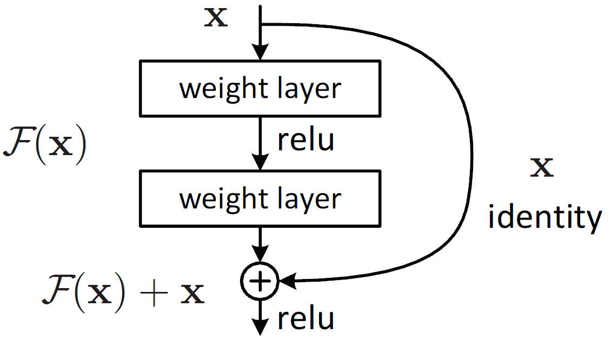
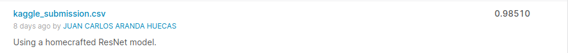

# Kaggle Digit Recognition

This is my first GitHub repo where I will upload all my code related to the kaggle 
Machine Learning competition in [Digit recognition](https://www.kaggle.com/c/digit-recognizer).

The **main goal** is to create a model that makes good inference from the MNIST data. My **personal objective** is to put in practice my skills with different convolutional neural networks
learned in the previous months.

## Table of contents
- [Model info](#model-info)
- [Guide](#guide)
    - [Training](#training)
    - [Inference](#inference)
    - [Docker for inference](#docker-for-inference)
- [Future additions](#future-additions)

## Model info

The model implemented is just a slightly variation of the original ResNet proposed by [He *et al*. in 2015](https://arxiv.org/abs/1512.03385). It is just a simple CNN which contains residual conections, which connect deeper layers with previous ones, allowing the model to create indenty mappings. This modification allowed the authors to train deeper models easily. The basic structure of the model is shown on the image below.

These architecture has allowed me to achieve a 0.985 score in the kaggle competition, improving by 0.12 my previous score (logistic regression).

## Guide

### Training

Training step is implmented in training.py. This scrpits works as a light command program that allows you to set your own training. An example of how is it used is shown below:

    python training.py --path <train.csv path> --outputPath <saving directory>

Try to use -h to see all options

    python training.py -h

### Inference

Inference step is included in inference.py. Following the same aproach as in training, the script comes with several command arguments that allow the user to set up the inference process. An example can be seen below:

    python inference.py --csvPath <your inference dataset path> --outputPath <directory to save the results>

To see all possible options:

    python inference.py -h

### Docker for inference

A image container has been build and push to DockerHub with my pretrained model. It can be used to make inference on your own data (it is important that your data has the same format as in the [kaggle competition](https://www.kaggle.com/c/digit-recognizer/data)). 

Before running the container, it is recomended to pull the image first:

    docker pull juanki0396/digit_recognizer:inference

To make it work, you just need to mount into the container your data directory, where you have the test.csv file:

    docker run --name inference \
                -v <your-data-dir>:/myapp/data \
                juanki0396/digit_recognizer:inference

When the task is finished, you will have a predictions.csv on data directory that has been mounted into the container

## Future additions

- Making GUI for inference
- ...