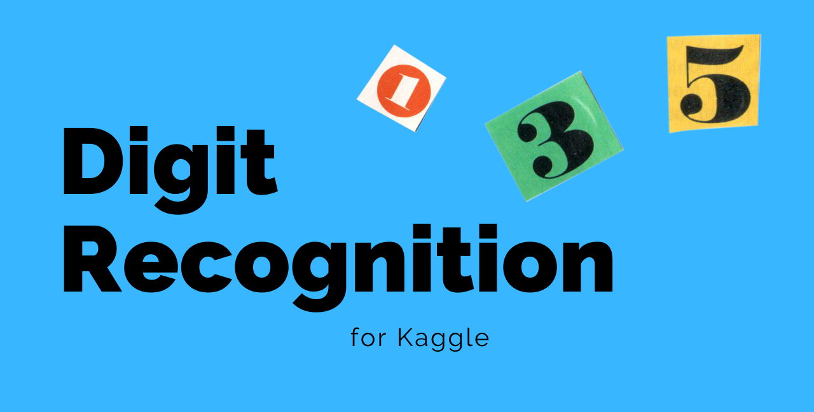

# Kaggle Digit Recognition

This is my first GitHub repo where I will upload all my code related to the kaggle 
Machine Learning competition in [Digit recognition](https://www.kaggle.com/c/digit-recognizer).

The **main goal** is to create a model that makes good inference from the MNIST data. My **personal objective** is to put in practice my skills with different convolutional neural networks
learned in the previous months.